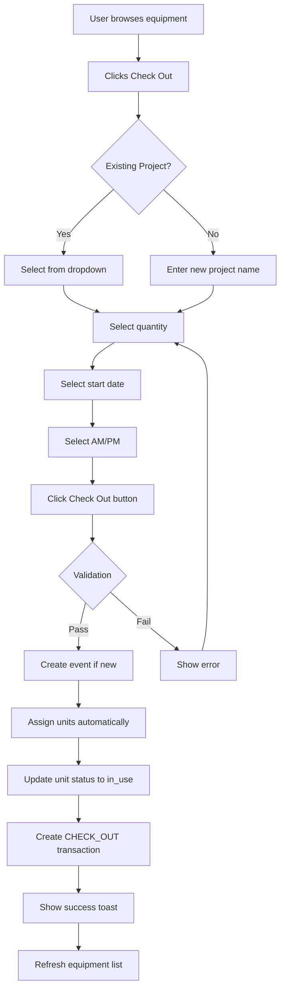
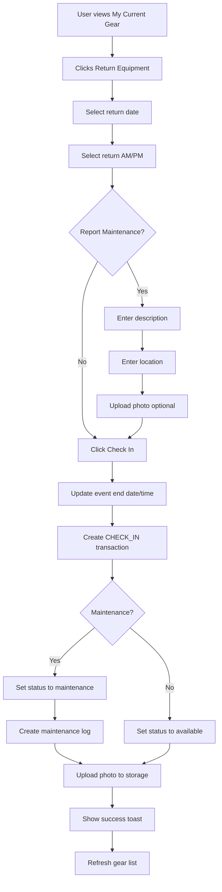

# Citywire Studios Inventory System - Technical Specification

## Table of Contents
1. [Project Overview](#project-overview)
2. [System Architecture](#system-architecture)
3. [Features](#features)
4. [Database Schema](#database-schema)
5. [User Flows](#user-flows)
6. [Component Structure](#component-structure)
7. [API Integration](#api-integration)
8. [Security](#security)
9. [Deployment](#deployment)
10. [Key Technical Patterns](#key-technical-patterns)

---

## Project Overview

### Purpose
Professional equipment inventory management system for Citywire Studios to track cameras, audio equipment, lighting, and support gear across video production projects.

### Key Requirements
- Non-serialized equipment tracking (search by type, not serial numbers)
- Project-based equipment checkout/return workflow
- Time period tracking (AM/PM) for equipment movements
- Real-time equipment status dashboard
- Bulk equipment return functionality
- Maintenance issue reporting with photo uploads
- Role-based access control (standard users vs managers)
- Equipment case with soft reservations (real-time cross-user sync)
- Date-aware availability (future bookings don't block today)
- Overlap detection with user-facing warnings
- Password reset via email
- Equipment CRUD management (add/edit/delete equipment & units)

### Technology Stack
- **Frontend**: React 18.3.1 + TypeScript 5.3.3
- **Build Tool**: Vite 5.0.12
- **Styling**: Tailwind CSS 3.4.1
- **UI Components**: Radix UI primitives (Dialog, Select, Toast, etc.)
- **Icons**: Lucide React
- **Backend**: Supabase (PostgreSQL, Auth, Storage, Realtime)
- **Database**: PostgreSQL with Row Level Security (RLS)

---

## System Architecture

### Architecture Pattern
Single-page application (SPA) with component-based architecture using React hooks for state management.

### Data Flow
```
User Action → Component → Custom Hook → Supabase Client → PostgreSQL
                ↓                                              ↓
           Local State ← ────────── Realtime Subscription ← ─┘
```

### Key Architectural Decisions

#### 1. Non-Serialized Equipment Tracking
**Decision**: Equipment grouped by type, not individual serial numbers
**Rationale**: Studio workflow focuses on "I need a Sony FX3" not "I need camera #12345"
**Implementation**:
- `equipment` table stores types (Sony FX3, Rode NTG3)
- `equipment_units` table stores individual units (FX3-001, FX3-002)
- System auto-assigns available units during checkout

#### 2. Time Period Storage (AM/PM)
**Decision**: Store time periods as JSON in `events.notes` field
**Rationale**: No database migration needed, flexible for future expansion
**Implementation**:
```json
{
  "start_time_period": "AM",
  "end_time_period": "PM"
}
```

#### 3. Event-Based Tracking
**Decision**: All equipment checkouts linked to events/projects
**Rationale**: Equipment always tied to a specific project, enables project-level reporting
**Implementation**: `events` table represents projects with start/end dates

---

## Features

### 1. Authentication & Authorization

#### User Roles
- **Standard User**: Can check out/in equipment, view their gear, report maintenance issues
- **Manager**: All standard permissions + access maintenance portal, view all maintenance reports

#### Authentication Flow
1. User signs up with email/password via Supabase Auth
2. Profile automatically created in `user_profiles` table
3. Default role: 'user'
4. Managers manually upgraded in database

#### Password Reset
1. User clicks "Forgot Password?" on login screen
2. Enters email address
3. Supabase sends password reset email with link
4. Link redirects back to app, `onAuthStateChange` handles the redirect
5. Auth URL fragments/errors cleaned up via `window.history.replaceState`

#### Implementation
- **Hook**: `src/hooks/use-auth.ts` (signIn, signUp, signOut, resetPassword)
- **Component**: `src/components/auth/AuthForm.tsx`
- **Security**: Row Level Security (RLS) policies enforce role-based access

---

### 2. Equipment Checkout

#### User Flow
1. User browses available equipment in "All Equipment" section
2. Clicks "Check Out" button on desired equipment
3. Modal opens with form:
   - **Quantity**: Number of units (1 to available count)
   - **Project**: Select existing project or create new
   - **Start Date**: When equipment will be taken
   - **Time Period**: AM or PM dropdown
4. System assigns specific units automatically
5. Transaction recorded, units marked as 'in_use'

#### Technical Details
- **Modal**: `src/components/checkout/CheckOutModal.tsx`
- **Equipment List**: `src/components/dashboard/EquipmentList.tsx`
- **Hook**: `src/hooks/use-equipment.ts`
- **Event Creation**: `src/hooks/use-events.ts` - `createEvent(projectName, startDate, timePeriod)`

#### Database Operations
```sql
-- Create event (if new project)
INSERT INTO events (project_name, start_date, notes)
VALUES ('CEO Interview', '2024-12-10', '{"start_time_period": "AM"}');

-- Update unit status
UPDATE equipment_units
SET current_status = 'in_use'
WHERE id IN (selected_unit_ids);

-- Record transaction
INSERT INTO transactions (unit_id, user_id, event_id, type)
VALUES ('unit-uuid', 'user-uuid', 'event-uuid', 'CHECK_OUT');
```

#### Validation Rules
- Cannot checkout more units than available
- Must select or create a project
- Start date cannot be empty
- Time period defaults to AM if not selected

---

### 3. Equipment Check-In (Return)

#### User Flow
1. User views "My Current Gear" section
2. Clicks "Return Equipment" on an item
3. Modal opens with form:
   - **Return Date**: When equipment returned
   - **Return Time**: AM or PM dropdown
   - **Report Maintenance**: Optional checkbox
   - If maintenance selected:
     - Issue description (required)
     - Current location (required)
     - Photo upload (optional)
4. System updates unit status and records transaction

#### Maintenance Reporting
When maintenance is flagged:
- Unit status set to 'maintenance' instead of 'available'
- Entry created in `maintenance_logs` table
- Photo uploaded to Supabase Storage (`maintenance-images` bucket)
- Managers can view all maintenance issues in Maintenance Portal

#### Technical Details
- **Modal**: `src/components/dashboard/CheckInModal.tsx`
- **Current Gear**: `src/components/dashboard/CurrentGear.tsx`
- **Hook**: `src/hooks/use-transactions.ts`
- **Event Update**: `src/hooks/use-events.ts` - `updateEventEnd(eventId, endDate, timePeriod)`

#### Database Operations
```sql
-- Update event end time
UPDATE events
SET end_date = '2024-12-15',
    notes = '{"start_time_period": "AM", "end_time_period": "PM"}'
WHERE id = 'event-uuid';

-- Record check-in transaction
INSERT INTO transactions (unit_id, user_id, event_id, type)
VALUES ('unit-uuid', 'user-uuid', 'event-uuid', 'CHECK_IN');

-- Update unit status
UPDATE equipment_units
SET current_status = 'available' -- or 'maintenance'
WHERE id = 'unit-uuid';

-- If maintenance reported
INSERT INTO maintenance_logs (unit_id, reporter_id, description, location_held, image_url)
VALUES ('unit-uuid', 'user-uuid', 'Lens stuck', 'Shelf B', 'https://...');
```

---

### 4. Time Period Tracking (AM/PM)

#### Purpose
Track when equipment was **actually** taken/returned (not when form was submitted).

#### User Experience
- Simple dropdown: Morning (AM) or Afternoon (PM)
- User logs in advance: "Taking Monday AM, returning Friday PM"
- Displayed throughout UI: "10 Dec (AM)" format

#### Display Format
- **Format Function**: `src/lib/utils.ts` - `formatDateWithPeriod(date, period)`
- **Example Output**: "12 Feb 2024 (AM)"
- **Fallback**: If no period stored, displays date only

#### Storage Strategy
**Location**: `events.notes` field (TEXT type, stores JSON)

**Structure**:
```json
{
  "start_time_period": "AM",
  "end_time_period": "PM"
}
```

**Benefits**:
- No database migration required
- Flexible for future metadata
- Can parse with `JSON.parse()`

#### Implementation Locations
- **Check-Out Modal**: User selects start time period
- **Check-In Modal**: User selects return time period
- **Current Gear**: Displays checkout date with period
- **Transaction History**: Shows full timeline with periods

---

### 5. Equipment Status Dashboard

#### Purpose
Real-time overview of ALL equipment showing availability and current holders.

#### Features
- Color-coded status indicators:
  - **Green**: All units available
  - **Yellow**: Some units in use
  - **Red**: All units checked out
- Breakdown per equipment type:
  - Total units count
  - Available count (green badge)
  - In-use count (blue badge)
  - Maintenance count (orange badge, if any)
- Lists users who currently have equipment checked out

#### User Interface
- Accessible via "Status" tab in main navigation
- Card-based layout (one card per equipment type)
- Real-time updates via Supabase subscriptions
- Sorted alphabetically by equipment name

#### Technical Details
- **Component**: `src/components/dashboard/EquipmentStatusDashboard.tsx`
- **Hook**: `src/hooks/use-equipment-status.ts`

#### Data Query Process
```typescript
// For each equipment type:
1. Get all units for equipment
2. Count by status (available, in_use, maintenance)
3. For in-use units:
   - Find most recent CHECK_OUT transaction
   - Verify no CHECK_IN after that
   - Get user profile (name)
   - Deduplicate users (same user may have multiple units)
4. Display aggregated data
```

#### Realtime Updates
```typescript
supabase
  .channel('equipment_status_changes')
  .on('postgres_changes', { table: 'equipment_units' }, () => refresh())
  .on('postgres_changes', { table: 'transactions' }, () => refresh())
  .subscribe();
```

---

### 6. Bulk Equipment Return

#### Purpose
Quick return of multiple items at once when a project ends.

#### User Flow
1. User navigates to "My Current Gear"
2. Checkboxes appear next to each equipment group
3. User selects multiple items
4. "Return Selected (X)" button appears in header
5. Click button → Bulk Return Modal opens
6. Modal shows:
   - List of all selected equipment
   - Unit counts per item
   - Single date/time picker (applies to all)
7. User confirms → All items returned at once

#### User Experience Enhancements
- Selected items have red ring highlight
- Button shows count of selected items
- Can unselect by unchecking boxes
- Selection persists until return or page change

#### Technical Details
- **Component**: `src/components/dashboard/CurrentGear.tsx` (checkbox logic)
- **Modal**: `src/components/dashboard/BulkCheckInModal.tsx`
- **State Management**:
  - `Set<string>` tracks selected group keys
  - Groups keyed by `${equipment_id}-${event_id}`

#### Database Operations
```typescript
// For each selected group:
for (const group of selectedGroups) {
  // Update event end time
  await updateEventEnd(group.event_id, endDate, timePeriod);

  // For each unit in group:
  for (const unit of group.units) {
    // Record check-in
    await createTransaction(unit.unit_id, userId, eventId, 'CHECK_IN');

    // Update status
    await updateUnitStatus(unit.unit_id, 'available');
  }
}
```

#### Performance Considerations
- Sequential processing (not parallel) to avoid race conditions
- Single date/time for all items reduces user input
- No maintenance reporting in bulk (use individual check-in for that)

---

### 7. Equipment Case & Soft Reservations

#### Purpose
Allow users to "build a kit" by adding multiple items to a case before checking them all out in one batch. Reservations are backed by the database and visible to all users in real-time.

#### User Flow
1. User browses equipment and clicks "Add to Case" on desired items
2. Case drawer opens showing selected items with quantities
3. User adjusts quantities or removes items
4. User sets start/return dates (propagated to all reservation rows)
5. Overlap warnings appear if dates conflict with other users' bookings
6. User clicks "Check Out" to complete the batch checkout
7. All items checked out, reservations cleared

#### Real-Time Cross-User Sync
- Each "Add to Case" creates/updates a row in `reservations` table
- Supabase Realtime broadcasts changes to all connected users
- Other users see reduced availability immediately
- Heartbeat extends `expires_at` every 2 minutes while case is active

#### Auto-Clear (8 Hours)
- If a user's reservations are older than 8 hours (based on `created_at`), they are automatically deleted
- Heartbeat interval checks oldest reservation age
- Toast notification shown to the user: "Your equipment case was automatically cleared after 8 hours"
- Prevents indefinite soft-locks on equipment

#### Technical Details
- **Component**: `src/components/checkout/EquipmentCase.tsx`
- **Hook**: `src/hooks/use-reservations.ts`
- **Constants**: `RESERVATION_TTL_MS = 30min`, `RESERVATION_MAX_AGE_MS = 8h`

#### Database Operations
```sql
-- Add/update reservation
INSERT INTO reservations (user_id, equipment_id, quantity, expires_at, start_date, end_date)
VALUES ('user-uuid', 'equip-uuid', 2, NOW() + INTERVAL '30 minutes', '2026-03-18', '2026-03-25')
ON CONFLICT (user_id, equipment_id)
DO UPDATE SET quantity = EXCLUDED.quantity, expires_at = EXCLUDED.expires_at;

-- Heartbeat extend
UPDATE reservations SET expires_at = NOW() + INTERVAL '30 minutes'
WHERE user_id = 'user-uuid';

-- Clear case
DELETE FROM reservations WHERE user_id = 'user-uuid';
```

---

### 8. Date-Aware Availability & Overlap Detection

#### Purpose
Equipment checked out for future dates should remain "available" until those dates arrive. When booking dates overlap with another user's booking, show a warning.

#### Date-Aware Availability Logic
- Reservations with `start_date = NULL` (items just added to case, no dates set) -> block availability immediately
- Reservations with `start_date`/`end_date` set -> only block availability if TODAY falls within that range
- Implemented in `reservationAffectsToday()` function

#### Overlap Detection
When a user selects dates for checkout, the system checks for conflicts against:
1. **Active checkouts** — other users' checked-out units from `equipmentStatus.checked_out_units`
2. **Dated reservations** — other users' reservation rows with `start_date`/`end_date`

**Overlap formula:** Two ranges [A_start, A_end] and [B_start, B_end] overlap when:
```
A_start <= B_end AND A_end >= B_start
```

#### Warning UI
- Orange warning banner with AlertTriangle icon
- Shows: "Overlaps with [UserName]'s [checkout/reservation] from [date] to [date]"
- **Non-blocking** — user can still proceed (they might know the other person will return early)
- Appears in both CheckOutModal and EquipmentCase

#### User Name Resolution
User names for overlap display are fetched from `user_profiles` table separately (PostgREST FK workaround). Results are cached in a `Map` to avoid repeated queries.

#### Technical Details
- **Hook**: `src/hooks/use-date-availability.ts`
- **Type**: `DateOverlap` in `src/types/index.ts`
- **Functions**:
  - `getOverlaps(equipmentId, startDate, endDate, currentUserId)` -> `DateOverlap[]`
  - `reservationAffectsToday(reservation)` -> `boolean`
  - `getCheckedOutUnits(equipmentId)` -> `CheckedOutUnit[]`

---

### 9. Kits Dashboard (My Gear + Team Kits)

#### Purpose
Show all currently checked-out equipment grouped by user in a horizontally scrollable carousel.

#### Layout
- First card: "My Gear" — current user's checked-out equipment with check-in capabilities
- Remaining cards: Team members' kits — read-only view of what other users have
- Scroll arrows (left/right) appear on desktop
- Snap-scroll behavior on mobile

#### Technical Details
- **Component**: `src/components/dashboard/TeamKitsCarousel.tsx` — `TeamKitCard` + `groupByUser()` helper
- **Component**: `src/components/dashboard/CurrentGear.tsx` — My Gear with check-in/bulk-return
- **Data Source**: `equipmentStatus` from `use-equipment-status.ts`

---

### 10. Proxy Return (Return on Behalf)

#### Purpose
Allow any user to return equipment on behalf of another user who is unavailable. This enables flexible equipment management when team members are off-site or unavailable to return gear themselves.

#### User Flow
1. User views the Team Kits carousel on the Inventory tab
2. Each team member's kit card displays a "Return" button
3. User clicks "Return" on a teammate's kit
4. ProxyReturnModal opens showing:
   - The teammate's name and email
   - Complete list of items in their kit (unit numbers, equipment names, categories)
   - Return date picker (defaults to today)
   - Time period selector (AM/PM)
5. User confirms the return
6. All items in the kit are returned in a single batch operation
7. Toast notification confirms success: "Returned X items on behalf of [User Name]"

#### Technical Implementation

**Component**: `src/components/dashboard/ProxyReturnModal.tsx`

**Props**:
```typescript
interface ProxyReturnModalProps {
  open: boolean;
  onClose: () => void;
  kit: TeamKit | null;
  currentUserId: string;
  currentUserName: string;
  onSuccess: () => void;
}
```

**Database Operations**:

For each equipment item in the kit:
1. Create CHECK_IN transaction with proxy metadata in notes field
2. Update equipment_unit status to 'available'

For each unique event in the kit:
1. Update event end_date to selected return date + time period
2. Store end_time_period in event notes JSON

**Proxy Metadata Format**:
```json
{
  "proxy_return": true,
  "returned_by_user_id": "uuid-of-person-doing-return",
  "returned_by_name": "John Smith"
}
```

This metadata is stored in `transactions.notes` field for full audit trail compliance.

#### Key Features
- **Batch Operation**: Returns all items in a kit simultaneously
- **Audit Trail**: Every transaction records who performed the return and on whose behalf
- **Date Flexibility**: Can backdate or future-date returns as needed
- **Event Management**: Automatically updates all associated event end dates
- **User-Friendly**: Single click returns entire kit with minimal input

#### Security Considerations
- **Open Access**: Any authenticated user can return another user's equipment
- **Audit Compliance**: All proxy returns are permanently logged in transactions table
- **No Restrictions**: No role-based restrictions (by design for operational flexibility)
- **Traceability**: Full chain of custody maintained through proxy metadata

#### UI/UX Details
- Modal displays scrollable list of items (max height with overflow)
- Unit numbers shown as badges for easy identification
- Categories displayed for context
- Return date defaults to current date for quick operations
- Informational note clarifies who is performing the return
- Loading state during async operations
- Error handling with toast notifications

#### Integration Points
- **Triggered From**: Team Kit cards in Kits carousel
- **Data Source**: `equipmentStatus` grouped by user via `groupByUser()` helper
- **Refreshes**: Equipment list, status dashboard, and checked-out gear after success
- **State Management**: `proxyReturnKit` state in App.tsx

---

### 11. Equipment Manager (CRUD)

#### Purpose
Allow managers to add, edit, and delete equipment types and their individual units.

#### Features
- Add new equipment (name, category)
- Edit equipment name and category
- Delete equipment (cascades to units and transactions)
- Add individual units to existing equipment
- Delete individual units
- Mark units as broken or repaired

#### Technical Details
- **Component**: `src/components/equipment-manager/EquipmentManager.tsx`
- **Hook**: `src/hooks/use-equipment.ts` — CRUD mutations with manual refetch after each

---

### 12. Transaction History

#### Features
- Complete audit trail of all equipment movements
- Filterable by:
  - Equipment type
  - Date range
  - Transaction type (CHECK_OUT / CHECK_IN)
- Sortable by date (newest first)
- Shows: Date, time, equipment, project, user, action

#### Technical Details
- **Component**: `src/components/history/TransactionHistory.tsx`
- **Query**: Joins transactions with equipment, users, and events

---

### 13. Maintenance Portal (Managers Only)

#### Features
- View all maintenance issues
- Filter by status (open, in_progress, resolved)
- View photos of damaged equipment
- Update maintenance status
- Mark equipment as repaired (returns to available)

#### Access Control
- Only visible to users with role='manager'
- Enforced in UI and via RLS policies

#### Technical Details
- **Component**: `src/components/maintenance/MaintenancePortal.tsx`
- **Storage**: Photos in `maintenance-images` Supabase bucket

---

## Database Schema

### Tables Overview

#### 1. equipment
Defines equipment types (not individual units).

```sql
CREATE TABLE equipment (
  id UUID PRIMARY KEY DEFAULT uuid_generate_v4(),
  name TEXT NOT NULL,
  category TEXT NOT NULL,
  manufacturer TEXT,
  model TEXT,
  description TEXT,
  created_at TIMESTAMP WITH TIME ZONE DEFAULT NOW()
);
```

**Example Rows**:
| id | name | category | manufacturer | model |
|----|------|----------|--------------|-------|
| uuid-1 | Sony FX3 | camera | Sony | FX3 |
| uuid-2 | Rode NTG3 | audio | Rode | NTG3 |

---

#### 2. equipment_units
Individual physical units of equipment.

```sql
CREATE TABLE equipment_units (
  id UUID PRIMARY KEY DEFAULT uuid_generate_v4(),
  equipment_id UUID REFERENCES equipment(id) ON DELETE CASCADE,
  unit_number TEXT UNIQUE NOT NULL,
  current_status TEXT NOT NULL CHECK (current_status IN ('available', 'in_use', 'maintenance')),
  purchase_date DATE,
  notes TEXT,
  created_at TIMESTAMP WITH TIME ZONE DEFAULT NOW()
);
```

**Status Values**:
- `available`: Ready to be checked out
- `in_use`: Currently checked out to a user
- `maintenance`: Flagged for repair, cannot be checked out

**Example Rows**:
| id | equipment_id | unit_number | current_status | purchase_date |
|----|--------------|-------------|----------------|---------------|
| uuid-a | uuid-1 | FX3-001 | in_use | 2023-06-15 |
| uuid-b | uuid-1 | FX3-002 | available | 2023-06-15 |

---

#### 3. events
Projects or shoots that equipment is checked out for.

```sql
CREATE TABLE events (
  id UUID PRIMARY KEY DEFAULT uuid_generate_v4(),
  project_name TEXT NOT NULL,
  start_date TIMESTAMP WITH TIME ZONE NOT NULL,
  end_date TIMESTAMP WITH TIME ZONE,
  created_by UUID REFERENCES auth.users(id),
  notes TEXT, -- Stores JSON with time periods
  created_at TIMESTAMP WITH TIME ZONE DEFAULT NOW()
);
```

**Notes Field Structure**:
```json
{
  "start_time_period": "AM",
  "end_time_period": "PM"
}
```

---

#### 4. transactions
Audit log of all check-out and check-in actions.

```sql
CREATE TABLE transactions (
  id UUID PRIMARY KEY DEFAULT uuid_generate_v4(),
  unit_id UUID REFERENCES equipment_units(id) ON DELETE CASCADE,
  user_id UUID REFERENCES auth.users(id),
  event_id UUID REFERENCES events(id) ON DELETE CASCADE,
  type TEXT NOT NULL CHECK (type IN ('CHECK_OUT', 'CHECK_IN')),
  timestamp TIMESTAMP WITH TIME ZONE DEFAULT NOW()
);
```

**Type Values**:
- `CHECK_OUT`: Equipment taken by user
- `CHECK_IN`: Equipment returned by user

**Example Rows**:
| id | unit_id | user_id | event_id | type | timestamp |
|----|---------|---------|----------|------|-----------|
| uuid-x | uuid-a | user-1 | event-1 | CHECK_OUT | 2024-12-10 09:00 |
| uuid-y | uuid-a | user-1 | event-1 | CHECK_IN | 2024-12-15 17:00 |

---

#### 5. maintenance_logs
Issues reported for equipment requiring repair.

```sql
CREATE TABLE maintenance_logs (
  id UUID PRIMARY KEY DEFAULT uuid_generate_v4(),
  unit_id UUID REFERENCES equipment_units(id) ON DELETE CASCADE,
  reporter_id UUID REFERENCES auth.users(id),
  description TEXT NOT NULL,
  location_held TEXT NOT NULL,
  image_url TEXT,
  status TEXT DEFAULT 'open' CHECK (status IN ('open', 'in_progress', 'resolved')),
  created_at TIMESTAMP WITH TIME ZONE DEFAULT NOW(),
  resolved_at TIMESTAMP WITH TIME ZONE
);
```

---

#### 6. reservations
Soft locks for equipment case items. Real-time synced across users.

```sql
CREATE TABLE reservations (
  id UUID PRIMARY KEY DEFAULT uuid_generate_v4(),
  user_id UUID REFERENCES auth.users(id) ON DELETE CASCADE,
  equipment_id UUID REFERENCES equipment(id) ON DELETE CASCADE,
  quantity INTEGER NOT NULL DEFAULT 1,
  expires_at TIMESTAMP WITH TIME ZONE NOT NULL,
  start_date TIMESTAMP WITH TIME ZONE,
  end_date TIMESTAMP WITH TIME ZONE,
  created_at TIMESTAMP WITH TIME ZONE DEFAULT NOW(),
  UNIQUE(user_id, equipment_id)
);
```

**Key Columns**:
- `expires_at`: TTL for heartbeat-based cleanup (30-minute window, extended every 2 minutes)
- `start_date`/`end_date`: Optional booking dates. NULL = blocks immediately; set = only blocks during range
- `UNIQUE(user_id, equipment_id)`: One reservation per user per equipment type (upsert pattern)

---

#### 7. user_profiles
Extended user information beyond Supabase Auth.

```sql
CREATE TABLE user_profiles (
  id UUID PRIMARY KEY REFERENCES auth.users(id) ON DELETE CASCADE,
  full_name TEXT,
  email TEXT,
  role TEXT DEFAULT 'user' CHECK (role IN ('user', 'manager')),
  created_at TIMESTAMP WITH TIME ZONE DEFAULT NOW()
);
```

---

### Database Indexes

```sql
CREATE INDEX idx_equipment_units_equipment_id ON equipment_units(equipment_id);
CREATE INDEX idx_equipment_units_status ON equipment_units(current_status);
CREATE INDEX idx_transactions_unit_id ON transactions(unit_id);
CREATE INDEX idx_transactions_user_id ON transactions(user_id);
CREATE INDEX idx_transactions_event_id ON transactions(event_id);
CREATE INDEX idx_transactions_timestamp ON transactions(timestamp DESC);
CREATE INDEX idx_maintenance_unit_id ON maintenance_logs(unit_id);
CREATE INDEX idx_maintenance_status ON maintenance_logs(status);
CREATE INDEX idx_reservations_dates ON reservations(equipment_id, start_date, end_date)
  WHERE start_date IS NOT NULL AND end_date IS NOT NULL;
```

---

### Row Level Security (RLS) Policies

#### Equipment & Units
- **SELECT**: All authenticated users can view
- **INSERT/UPDATE/DELETE**: Managers only

#### Transactions
- **SELECT**: Users can view their own transactions, managers can view all
- **INSERT**: All authenticated users (for checkout/checkin)
- **UPDATE/DELETE**: Managers only

#### Maintenance Logs
- **SELECT**: Managers can view all, users can view their own reports
- **INSERT**: All authenticated users (to report issues)
- **UPDATE**: Managers only (to change status)

---

## User Flows

### Complete Checkout Flow



### Complete Check-In Flow



---

## Component Structure

### Directory Layout
```
src/
├── components/
│   ├── auth/
│   │   └── AuthForm.tsx              # Login/signup/forgot-password form
│   ├── dashboard/
│   │   ├── DashboardLayout.tsx       # Main layout with nav
│   │   ├── EquipmentList.tsx         # Browse all equipment
│   │   ├── CurrentGear.tsx           # My Gear card
│   │   ├── TeamKitsCarousel.tsx      # Team kits carousel + groupByUser
│   │   ├── EquipmentStatusDashboard.tsx  # Status overview
│   │   ├── CheckInModal.tsx          # Single item return
│   │   └── BulkCheckInModal.tsx      # Multi-item return
│   ├── checkout/
│   │   ├── CheckOutModal.tsx         # Single-item checkout + overlap warnings
│   │   └── EquipmentCase.tsx         # Batch checkout drawer + overlap warnings
│   ├── equipment-manager/
│   │   └── EquipmentManager.tsx      # CRUD for equipment & units
│   ├── maintenance/
│   │   └── MaintenancePortal.tsx     # Manager maintenance view
│   ├── history/
│   │   └── TransactionHistory.tsx    # Audit log
│   └── ui/                           # Shadcn/ui components
│       ├── button.tsx
│       ├── card.tsx
│       ├── dialog.tsx
│       ├── input.tsx
│       ├── label.tsx
│       ├── select.tsx
│       ├── toast.tsx
│       └── toaster.tsx
├── hooks/
│   ├── use-auth.ts                   # Authentication + password reset
│   ├── use-equipment.ts              # Equipment CRUD + mutations
│   ├── use-equipment-status.ts       # Status dashboard data
│   ├── use-events.ts                 # Events/projects CRUD
│   ├── use-transactions.ts           # Checkout/checkin
│   ├── use-reservations.ts           # Soft reservations + heartbeat + auto-clear
│   ├── use-date-availability.ts      # Overlap detection + date-aware availability
│   └── use-toast.ts                  # Toast notifications
├── lib/
│   ├── supabase.ts                   # Supabase client
│   └── utils.ts                      # Helper functions
├── types/
│   ├── database.ts                   # Supabase types (incl. reservations)
│   └── index.ts                      # App types (DateOverlap, CaseItem, etc.)
├── App.tsx                           # Root component
└── main.tsx                          # Entry point
```

### Key Component Props

#### CheckOutModal
```typescript
interface CheckOutModalProps {
  open: boolean;
  onClose: () => void;
  equipment: EquipmentWithUnits | null;
  events: Event[];
  userId: string;
  onSuccess: () => void;
  onCreateEvent: (name: string, date: Date, timePeriod?: 'AM'|'PM', endDate?: Date, endTimePeriod?: 'AM'|'PM') => Promise<{data: Event|null; error: any}>;
  onDeleteEvent: (eventId: string) => Promise<{error: any}>;
  getOverlaps?: (equipmentId: string, startDate: string, endDate: string, userId: string) => DateOverlap[];
}
```

#### CurrentGear
```typescript
interface CurrentGearProps {
  checkedOutGear: CheckedOutItem[];
  userId: string;
  onCheckIn: () => void;
  onUpdateEventEnd?: (eventId: string, endDate: Date, period?: 'AM'|'PM') => Promise<{data: any; error: any}>;
}
```

---

## API Integration

### Supabase Configuration

#### Environment Variables
```env
VITE_SUPABASE_URL=https://your-project.supabase.co
VITE_SUPABASE_ANON_KEY=your-anon-key
```

#### Client Setup
```typescript
// src/lib/supabase.ts
import { createClient } from '@supabase/supabase-js';

export const supabase = createClient(
  import.meta.env.VITE_SUPABASE_URL,
  import.meta.env.VITE_SUPABASE_ANON_KEY,
  {
    auth: {
      persistSession: true,
      autoRefreshToken: true,
    },
  }
);
```

### Common Query Patterns

#### Fetch Equipment with Units
```typescript
const { data, error } = await supabase
  .from('equipment')
  .select(`
    *,
    units:equipment_units(*)
  `)
  .order('name');
```

#### Check Out Equipment
```typescript
// 1. Create event
const { data: event } = await supabase
  .from('events')
  .insert({ project_name, start_date, notes })
  .select()
  .single();

// 2. Update units
await supabase
  .from('equipment_units')
  .update({ current_status: 'in_use' })
  .in('id', unitIds);

// 3. Create transactions
await supabase
  .from('transactions')
  .insert(unitIds.map(id => ({
    unit_id: id,
    user_id: userId,
    event_id: event.id,
    type: 'CHECK_OUT'
  })));
```

### Realtime Subscriptions

```typescript
// Subscribe to equipment changes
const subscription = supabase
  .channel('equipment_changes')
  .on('postgres_changes', {
    event: '*',
    schema: 'public',
    table: 'equipment_units'
  }, (payload) => {
    console.log('Change received!', payload);
    refreshEquipment();
  })
  .subscribe();

// Cleanup
return () => subscription.unsubscribe();
```

---

## Security

### Authentication
- Email/password via Supabase Auth
- JWT tokens stored in localStorage
- Auto-refresh on expiration

### Authorization
- Row Level Security (RLS) on all tables
- Role-based policies (user vs manager)
- Server-side validation

### Data Validation
- TypeScript type checking
- Database constraints (CHECK, NOT NULL, UNIQUE)
- Form validation in components

### File Upload Security
- Restricted to `maintenance-images` bucket
- Max file size enforced
- Image file types only
- Public read, authenticated write

---

## Deployment

### Build Process
```bash
npm run build
```

Outputs to `dist/` directory.

### Vercel Deployment (Current)
1. Push to GitHub (master branch)
2. Vercel auto-deploys on push
3. Environment variables configured in Vercel dashboard:
   - `VITE_SUPABASE_URL` — `https://<project-id>.supabase.co`
   - `VITE_SUPABASE_ANON_KEY` — Supabase anonymous/public key
4. `vercel.json` handles SPA routing:
```json
{
  "rewrites": [{ "source": "/(.*)", "destination": "/index.html" }]
}
```

### Environment Setup
1. Create Supabase project
2. Run migrations from `supabase/migrations/`
3. Run additional SQL for reservations table (start_date, end_date columns)
4. Set up storage bucket: `maintenance-images`
5. Configure environment variables
6. Deploy frontend to Vercel (auto-deploy from GitHub)

### Database Migrations
```bash
# Run migrations in Supabase SQL Editor
# 001_initial_schema.sql — Core tables
# 002_rls_policies.sql — Row Level Security
# 003_seed_data.sql — Sample equipment

# Additional migrations (run manually in SQL Editor):
# - Add reservations table
# - Add start_date/end_date to reservations
# - Add broken status to unit_status enum
```

---

## Future Enhancements

### Planned Features
1. **QR Code Scanning**: Generate QR codes for units, scan to checkout/checkin
2. **Notifications**: Email reminders for overdue equipment
3. **Analytics Dashboard**: Equipment utilization metrics
4. ~~**Reservation System**: Book equipment in advance~~ *(Implemented - Equipment Case with soft reservations)*
5. **Mobile App**: React Native version for on-set use
6. **Export Reports**: PDF/CSV export of transactions
7. **Equipment Maintenance Schedule**: Preventive maintenance tracking
8. ~~**User Groups/Teams**: Assign equipment to teams not individuals~~ *(Partially implemented - Team Kits carousel)*

### Technical Debt
- Add comprehensive error boundary components
- Implement proper loading states with skeletons
- Add unit tests (Jest + React Testing Library)
- Add E2E tests (Playwright or Cypress)
- Optimize bundle size (code splitting)
- Add offline support (PWA)

---

## Appendix

### Naming Conventions
- **Components**: PascalCase (e.g., `CheckOutModal.tsx`)
- **Hooks**: camelCase with `use` prefix (e.g., `use-equipment.ts`)
- **Types**: PascalCase (e.g., `EquipmentWithUnits`)
- **Database tables**: snake_case (e.g., `equipment_units`)
- **Database columns**: snake_case (e.g., `current_status`)

### Code Style
- Prettier for formatting
- ESLint for linting
- 2-space indentation
- Single quotes for strings
- Trailing commas

### Git Workflow
- `main` branch for production
- Feature branches: `feature/description`
- Commit messages: Conventional Commits format

---

---

## Key Technical Patterns

### PostgREST FK Workaround
`transactions.user_id` references `auth.users(id)`, NOT `user_profiles(id)`. PostgREST cannot auto-detect this indirect relationship, so joins like `.select('*, user_profiles(*)')` silently return null for `user_profiles`.

**Fix**: Always fetch transactions with `.select('*')` (no joins), then query `user_profiles` separately by `user_id`. Use `Promise.all()` to parallelize.

**Applied in**:
- `src/components/history/TransactionHistory.tsx` — multi-step batch fetch
- `src/hooks/use-equipment-status.ts` — per-unit separate queries
- `src/hooks/use-date-availability.ts` — cached user name resolution

### Mutation + Manual Refetch Pattern
Supabase Realtime subscriptions are unreliable as the sole UI update mechanism. After every successful mutation, always call the fetch function manually:
```typescript
const { error } = await supabase.from('table').insert({...});
if (!error) await fetchData(); // Always refetch after mutation
```

**Applied in**: `use-equipment.ts` (all 7 CRUD functions), `use-reservations.ts` (all mutation functions)

### Reservation Lifecycle
1. **Add to case**: `upsertReservation()` → creates row with 30-min TTL
2. **Heartbeat**: Extends `expires_at` every 2 minutes while case has items
3. **Set dates**: `updateReservationDates()` → batch-updates all user's reservations with start/end dates
4. **Checkout**: `clearMyReservations()` → deletes all reservation rows
5. **Auto-clear**: After 8 hours (based on oldest `created_at`), all reservations deleted with toast notification

### Date Range Overlap Detection
Two ranges [A_start, A_end] and [B_start, B_end] overlap when:
```
A_start <= B_end AND A_end >= B_start
```
Implemented in `use-date-availability.ts`. Runs client-side over in-memory arrays (fast for ~10 users). Day-level granularity (AM/PM ignored for overlap purposes).

### Overflow & Tooltips
Parent container with `overflow-hidden` in EquipmentStatusDashboard clips absolutely-positioned elements. CSS-only tooltips don't work inside it. Use inline text or React portals instead.

---

**Document Version**: 2.0
**Last Updated**: 2026-03-06
**Authors**: Citywire Studios Development Team
